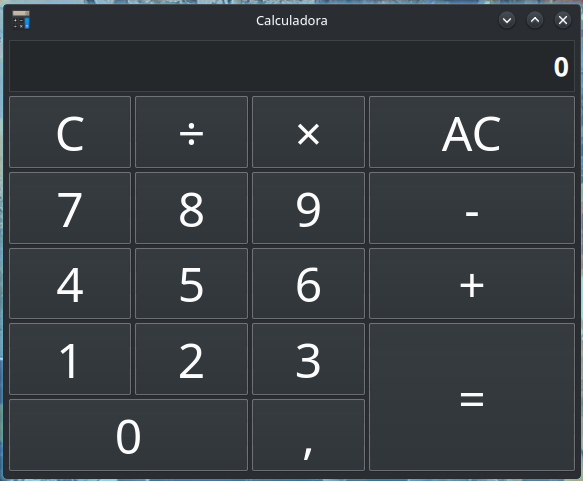
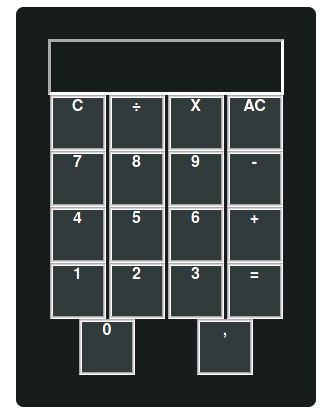
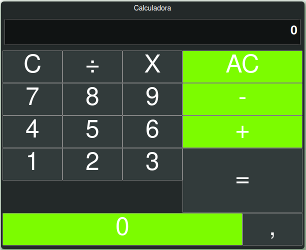
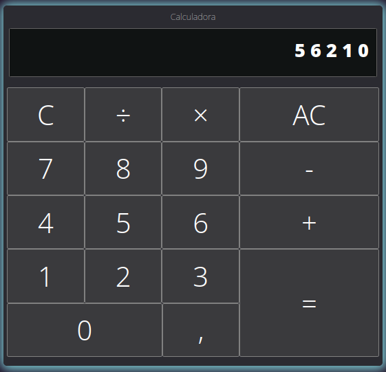

# Calculadora Básica ( KDE Calculator ) 

Esta calculadora está sendo desenvolvida para exercitar HTML | CSS | JS e futuramente React.js.
Em vez de utilizar media queries optei por somente utilizar unidades relativas para adicionar responsividade. No momento a lógica da calculadora está pouco desenvolvida, mas em breve vou implementar.

Obs: Por enquanto ela só mostra no display o que for digitado no teclado e não realiza cálculos ainda.

A interface gráfica da calculadora foi inspirada na calculadora padrão que vem no ambiente gráfico KDE de distribuições GNU/Linux.

## Sobre a autoria

Este projeto tem o intuito de aperfeiçoar, treinar e exercitar o conhecimento sobre as tecnologias da Web.
Todo código será criado sem framework, somente consultando o layout base e documentação do Mozilla MDN.

#

## Objetivo geral

Reproduzir com HTML, CSS JS a calculadora, inspirada no Layout Base. Isso inclui funcionalidades básicas de cálculos da calculadora padrão presente no ambiente gráfico KDE do Linux.

## Ferramentas utilizadas

Estou utilizando o editor de código VSCODE-Insiders, sistema operacional GNU Arch Linux instalado e configurado manualmente, navegador Mozilla Firefox, controle de versão Git via CLI e extensão Live Server do VSCODE.

#

## Objetivos específicos

- Exercitar HTML, CSS e JS
- Exercitar a codificação nas linguagens da Web a partir de um layout ou APP
- Aplicar os conceitos e propriedades do CSS no documento HTML
- Estruturar o documento HTML
- Aplicar conhecimento de GIT e linha de comando
- Exercitar a busca por documentação técnica e boas práticas
- Aplicar design responsivo
- Utilizar media queries

#

## Imagens layout/design do App
#

#### <b>Layout Base da Calculadora<b>

#

#### <b>Primeira Versão<b>

#

#### <b>Segunda Versão<b>

#

#### <b>Versão Atual<b>

#

